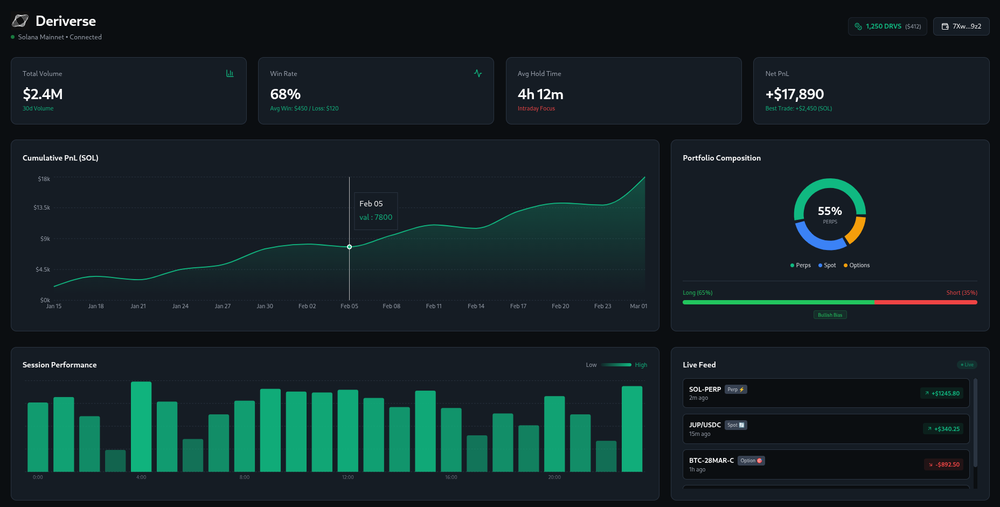
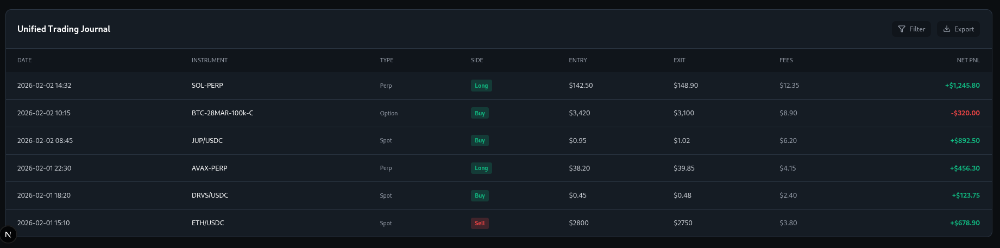

<div align="center">

# 📊 Deriverse Analytics Dashboard
### A high-fidelity, comprehensive trading analytics interface built for the Deriverse Ecosystem.






</div>

---

> [!IMPORTANT]
> **⚠️ Note for Judges:**
> This submission is a **Frontend-First Prototype**. To ensure maximum stability and zero latency during the judging period, the application runs on a **deterministic static data service** (simulating API responses). The architecture is designed to be fully non-custodial and pluggable into the Deriverse Indexer SDK.

---

## 💡 Overview

This dashboard addresses the critical need for **unified performance tracking** across Spot, Perpetuals, and Options. While most exchanges fragment this data, our solution aggregates it into a single **"Trader Health"** view, offering unique insights like Session Heatmaps and Bias Analysis.

## 🏆 How I Met the Criteria

### 1. Comprehensiveness & Innovation
I went beyond simple PnL charts to offer deep insights:

| Feature | Description |
| :--- | :--- |
| **Unified Portfolio View** | Aggregates Spot, Perps, and Options exposure in one dynamic donut chart. |
| **Session Heatmap** | A GitHub-style contribution graph for trading activity, identifying a trader's "golden hours." |
| **Long/Short Bias Meter** | Visualizes psychological trading patterns and market exposure. |
| **Ecosystem Rewards** | Dedicated tracking for DRVS fee rebates and ecosystem allocation. |

### 2. Clarity & Readability
* **🌑 Dark Mode Native:** Designed specifically for low eye strain during long trading sessions.
* **🟢 Color Logic:** Standardized Green/Red signals for instant decision-making.
* **📱 Responsive:** Fully optimized for desktop and tablet analysis.

### 3. Security & Data Privacy
* **Non-Custodial Architecture:** The dashboard is a client-side interface. It reads on-chain data but **never requires private keys**.
* **No Central Database:** User trade history is fetched directly from the chain (simulated for this demo). No user data is stored on our servers, eliminating central breach risks.

---

## 🛠 Tech Stack

- **Framework:** `Next.js 14` (App Router)
- **Styling:** `Tailwind CSS` (Custom "Deriverse" Dark Theme)
- **Visualization:** `Recharts` (Responsive, accelerated SVGs)
- **Icons:** `Lucide React`

---

## 🚀 Getting Started

To run the dashboard locally:

```bash
# 1. Clone the repository
git clone [https://github.com/01Laurent/Deriverse-Analytics.git](https://github.com/01Laurent/Deriverse-Analytics.git)

# 2. Install dependencies
npm install

# 3. Run the development server
npm run dev

Open http://localhost:3000 to view the analytics suite.

---
🔮 Future Roadmap
[ ] Live Indexer Integration: Replace static data with Deriverse GraphQL calls.

[ ] Wallet Sign-In: Integrate Solana Wallet Adapter (Phantom/Backpack).

[ ] PDF Export: Generate tax-friendly PnL reports directly from the Journal.

---

<div align="center">
<sub>Built with ❤️ for the Deriverse </sub>
</div>
